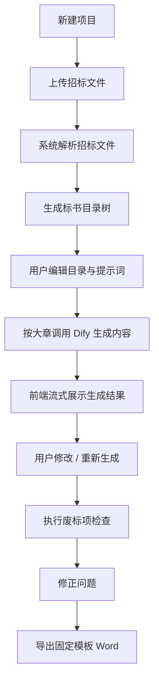

# 01. 项目总览

## 1. 项目名称

AI 智能标书系统

## 2. 项目背景

传统标书编制通常存在以下问题：

- 招标文件篇幅长，目录和要求人工整理成本高。
- 标书撰写依赖经验人员，重复劳动多，效率低。
- 不同章节内容风格不统一，容易遗漏评分项或响应项。
- 废标项检查依赖人工核对，风险高。
- 最终成稿需要按固定格式导出 Word，排版工作量大。

因此需要建设一个基于大模型的 Web 系统，辅助完成“解析招标文件 ->自动生成并可 编辑目录与提示词 -> 分章生成 -> 废标检查 -> 固定模板导出”的完整流程。

## 3. 产品目标

### 3.1 业务目标

- 将标书编写效率提升到可用的自动化水平。
- 减少人工整理目录、拆章节、复制粘贴的时间。
- 降低因遗漏响应项、资格项导致的废标风险。
- 统一导出结果格式，减少最终排版时间。

### 3.2 产品目标

- 用户上传招标文件后，系统自动根据招标文件内容（一般包含标书格式）提取标书目录。
- 用户可以对已经生成目录树和每节提示词进行自由编辑。
- 系统按“大章”维度流式生成内容，生成过程可视可控。
- 用户可对生成结果进行重新生成或人工修改。
- 系统支持知识库辅助生成。
- 系统支持废标项检查，并输出问题清单。
- 系统支持导出为固定格式 Word 文件。

## 4. 目标用户

### 4.1 主要用户

- 标书编制人员
- 商务投标人员
- 项目经理

### 4.2 次要用户

- 质量复核人员
- 企业知识库维护人员

## 5. 首期范围

### 5.1 In Scope

- 创建标书项目
- 上传招标文件
- 自动生成并抽取目录树
- 目录树编辑
- 大章级提示词编辑
- 按大章生成标书内容
- 生成结果流式展示
- 重新生成
- 在线编辑生成内容
- 知识库管理与引用
- 废标项检查
- 将生成的内容汇总按固定模板导出 Word

### 5.2 Out of Scope

- 多组织与多租户权限系统
- 在线多人协同编辑
- 审批流和会签
- word/pdf等多种导出格式
- 与 OA/ERP/电子招投标平台打通
- 自动提交投标文件

## 6. 核心业务流程

## 7. 关键设计原则

- 用户始终可编辑：AI 生成的目录与正文都必须允许人工覆盖。
- 分阶段可控：按大章生成，而不是一次性整本输出。
- 痕迹清晰：记录每章当前版本、生成时间、生成来源。
- 模板固定：Word 导出以固定样式为准，避免输出格式不可控。
- 模型可替换：业务层不直接绑死某一个模型，统一走 Dify。

## 8. 项目边界假设

- 招标文件不一定结构规整，因此目录抽取需要允许人工修订。
- 大模型生成内容不能直接视为最终定稿，必须允许人工修改。
- 废标项检查结果是“风险提示”，最终责任仍由人工复核承担。
- 导出 Word 时，正文结构遵从系统内目录树的层级。

## 9. 交付成果定义

首期项目完成后，用户应能在系统中完整完成以下动作：

1. 新建一个投标项目。
2. 上传一份招标文件。
3. 系统自动生成标书章节树。
4. 用户修改章节标题与写作要求。
5. 用户逐章生成并编辑标书内容。
6. 用户上传或选择知识库资料辅助生成。
7. 用户执行废标项检查并查看问题清单。
8. 用户导出固定格式 Word 文档。
