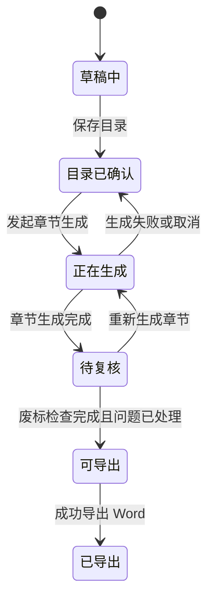

# 03. 功能规格说明书

## 1. 页面结构

首期建议页面结构如下：

1. 项目列表页
2. 项目详情页
3. 目录编辑页
4. 章节生成页
5. 知识库管理页
6. 废标检查页
7. 导出页

如果希望降低页面数量，也可以把 3-7 合并到“项目工作台”中，以左侧导航切换模块。

## 2. 项目列表页

### 2.1 功能

- 展示项目列表
- 新建项目
- 查看项目状态
- 进入项目详情

### 2.2 列表字段

- 项目名称
- 招标单位
- 标段名称
- 当前状态
- 最后更新时间
- 操作

### 2.3 交互

- 点击“新建项目”弹出表单
- 点击某项目进入工作台

## 3. 项目详情 / 工作台

### 3.1 工作台分区建议

- 左侧：项目导航
- 中间：当前模块主工作区
- 右侧：操作区 / 状态区 / 版本区

### 3.2 模块导航

- 招标文件
- 目录编辑
- 正文生成
- 知识库
- 废标检查
- 导出

## 4. 招标文件上传模块

### 4.1 输入

- 招标文件
- 项目名称
- 可选补充说明

### 4.2 输出

- 文件上传状态
- 文件解析状态
- 招标文件摘要
- 自动生成的目录树

### 4.3 前端状态

- 未上传
- 上传中
- 解析中
- 解析成功
- 解析失败

### 4.4 交互要求

- 上传后立即显示文件名和大小
- 上传成功后展示“开始解析”或自动进入解析
- 解析成功后跳转或展开目录编辑模块
- 解析失败后展示错误信息和重试按钮

### 4.5 边界处理

- 文件类型不支持
- 文件过大
- 文件内容为空或无法提取文本
- 大模型返回目录结构异常

## 5. 目录编辑模块

### 5.1 页面布局

- 左侧为树状目录
- 右侧为选中节点配置面板

### 5.2 树节点字段

- `id`
- `parentId`
- `level`
- `title`
- `promptRequirement`
- `orderNo`
- `nodeType`
- `status`

### 5.3 支持操作

- 新增同级节点
- 新增子节点
- 删除节点
- 重命名节点
- 调整顺序
- 复制节点
- 编辑提示词

### 5.4 配置面板字段

- 节点标题
- 节点类型
- 写作要求
- 是否启用知识库
- 关联知识库范围

### 5.5 保存逻辑

- 用户点击保存后统一提交当前目录树
- 后端返回保存结果与最新版本号

### 5.6 交互约束

- 至少保留一个一级节点
- 已有关联内容的节点删除时应二次确认
- 拖拽调整后要即时反馈新顺序

## 6. 章节生成模块

### 6.1 页面布局建议

- 左侧：目录树与章节状态
- 中间：正文编辑器
- 右侧：章节信息、提示词、知识库引用、版本列表

### 6.2 章节状态

- 未生成
- 生成中
- 已生成
- 已人工修改
- 生成失败

### 6.3 核心操作

- 选择大章
- 点击“生成本章”
- 流式查看生成结果
- 停止生成
- 重新生成
- 保存修改
- 查看版本

### 6.4 流式展示要求

- 前端通过 SSE 或等效机制接收流式文本
- 编辑器中实时追加内容
- 若生成异常中止，保留已生成片段，并提示失败状态

### 6.5 重新生成逻辑

- 用户选择“覆盖当前版本重新生成”或“保留当前版本并生成新版本”
- 系统保留版本历史
- 默认使用当前最新目录标题与提示词发起新生成

### 6.6 人工编辑逻辑

- 编辑器支持实时修改
- 用户手工修改后，章节状态变为“已人工修改”
- 保存后可参与废标检查和导出

### 6.7 章节粒度定义

首期建议按一级章节生成，即：

- 一次调用生成一个大章
- 大章内部可按小节结构组织输出

原因：

- 便于控制上下文长度
- 便于用户逐章校正
- 便于失败重试

## 7. 知识库模块

### 7.1 类型建议

- 企业资质
- 历史业绩
- 人员简历
- 技术方案素材
- 管理制度
- 通用模板

### 7.2 页面能力

- 上传知识文件
- 查看知识文件列表
- 查看文件来源与状态
- 删除或停用文件
- 绑定到项目

### 7.3 项目内使用方式

- 全项目默认知识库
- 按章节指定知识库

### 7.4 交互要求

- 用户可以明确知道当前生成用了哪些知识库
- 若知识库未命中，前端可提示“本次未引用到有效知识片段”

## 8. 废标检查模块

### 8.1 输入

- 招标文件全文或摘要
- 当前项目目录
- 当前项目正文内容

### 8.2 输出

- 检查项列表
- 风险等级
- 风险说明
- 建议处理方案
- 对应章节定位

### 8.3 结果分类建议

- 高风险：可能直接导致废标
- 中风险：可能导致评分不足或响应不完整
- 低风险：建议补充或优化

### 8.4 展示方式

- 列表视图
- 可按风险等级筛选
- 支持点击定位到章节

### 8.5 执行逻辑

- 用户可手动触发
- 当主要章节均已生成后，系统也可提示执行检查

## 9. 导出模块

### 9.1 输入

- 项目元信息
- 目录树
- 每章最终正文
- 导出模板

### 9.2 输出

- `.docx` 文件

### 9.3 页面能力

- 选择导出模板
- 配置封面字段
- 预览导出范围
- 生成 Word
- 下载 Word

### 9.4 交互要求

- 导出前提示未生成或未保存的章节
- 导出中显示状态
- 导出成功后可下载文件

## 10. 关键业务状态机

## 11. 异常场景要求

### 11.1 解析失败

- 允许重新上传文件
- 允许重新触发解析

### 11.2 流式生成失败

- 页面保留已收到内容
- 用户可直接重试

### 11.3 知识库不可用

- 允许降级为不带知识库生成
- 页面给出提示

### 11.4 导出失败

- 保留导出任务记录
- 允许重试导出
