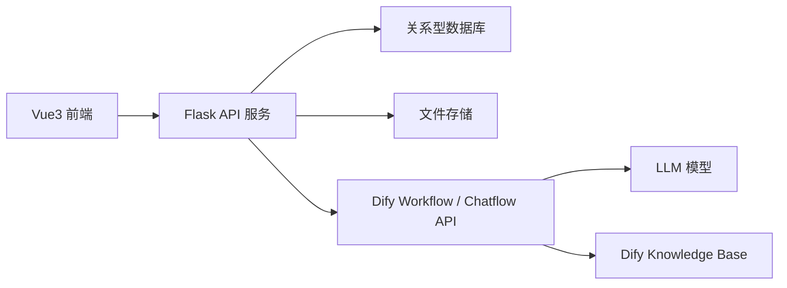
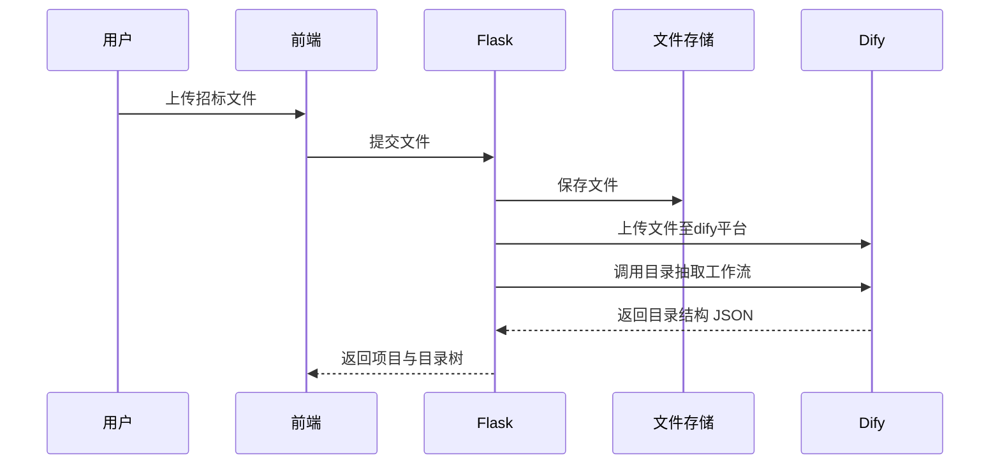
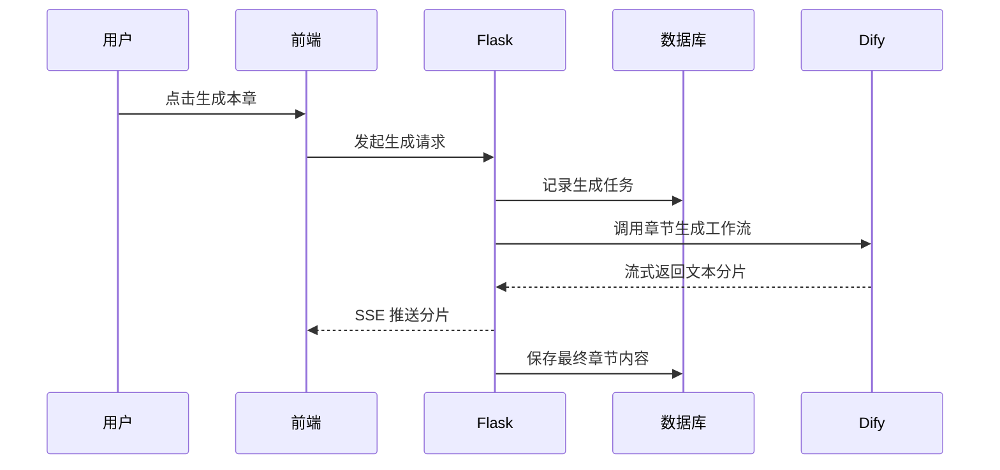
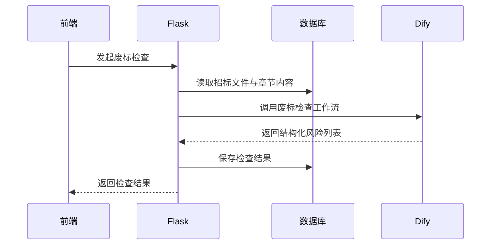

# 04. 技术方案与系统架构

## 1. 技术栈约束

- 前端：Vue 3 + TypeScript
- 后端：Python + Flask + uv
- 大模型平台：Dify
- 知识库平台：ragflow

## 2. 总体架构

## 3. 架构分层

### 3.1 前端层

职责：

- 项目工作台页面
- 目录树编辑
- 富文本或类 Markdown 编辑器
- 流式结果展示
- 导出任务查看

建议模块：

- `views/projects`
- `views/workspace`
- `components/outline-tree`
- `components/chapter-editor`
- `components/check-result-list`
- `services/api`

### 3.2 后端应用层

职责：

- 项目与文件管理
- 目录树管理
- 章节生成任务编排
- 知识库绑定信息管理
- 废标检查任务编排
- Word 导出

建议模块：

- `project`
- `file`
- `outline`
- `generation`
- `knowledge`
- `review`
- `export`

### 3.3 Dify 编排层

职责：

- 招标文件解析与目录抽取
- 分章正文生成
- 废标项抽取与检查
- 知识库检索增强

设计原则：

- 业务系统不直接拼装最终模型 HTTP 请求，而是统一通过 Dify 工作流。
- Dify 负责大模型提示词编排、知识库召回、结构化输出。
- Flask 负责项目状态、上下文组织、结果持久化。

## 4. 推荐存储设计

### 4.1 关系型数据库

建议：

- 开发环境：SQLite 

存储内容：

- 项目基本信息
- 文件元数据
- 目录树
- 章节正文
- 版本记录
- 检查结果
- 导出记录

### 4.2 文件存储

可选方案：

- 本地文件系统

  

存储内容：

- 上传的招标文件
- 上传的知识库资料副本
- 导出的 Word 文件

### 4.3 ragflow 知识库存储

建议职责边界：

- 企业知识文档切片和检索交给 ragflow
- 业务系统只维护“知识文件元信息、绑定关系、启停状态”

## 5. 核心调用链路

## 5.1 招标文件解析链路

## 5.2 章节生成链路

## 5.3 废标检查链路

## 6. 流式生成方案

### 6.1 推荐方案

推荐使用 SSE：

- 前端容易接入
- 适合单向文本流
- 实现成本低于 WebSocket

### 6.2 基本流程

1. 前端调用“创建章节生成任务”接口。
2. 后端向 Dify 发起流式请求。
3. 后端将 Dify 返回的文本分片转发为 SSE 事件。
4. 前端实时追加到编辑器。
5. 完成后后端落库最终版本。

### 6.3 事件类型建议

- `start`
- `delta`
- `progress`
- `complete`
- `error`

## 7. Dify 集成建议

### 7.1 建议拆分为三个工作流

1. 招标文件目录抽取工作流
2. 标书章节生成工作流
3. 废标项检查工作流

### 7.2 这样拆分的原因

- 输入输出边界清晰
- 更便于单独调试
- 不同工作流可以独立优化提示词
- 减少一个超长工作流带来的复杂性

### 7.3 集成方式

后端维护：

- Dify API Key
- Workflow ID / App ID
- 超时配置
- 重试策略

前端不直接调用 Dify。

## 8. 后端模块职责建议

### 8.1 `project`

- 创建项目
- 查询项目
- 更新项目状态

### 8.2 `file`

- 文件上传
- 文件校验
- 文件路径管理
- 文本提取

### 8.3 `outline`

- 保存目录树
- 查询目录树
- 校验节点结构

### 8.4 `generation`

- 发起生成
- 管理生成任务
- 持久化版本
- 转发流式结果

### 8.5 `knowledge`

- 知识文件上传
- 项目绑定关系
- Dify dataset 元信息同步

### 8.6 `review`

- 废标项抽取
- 风险结果落库
- 风险状态追踪

### 8.7 `export`

- 整理最终内容
- 套用模板导出 Word
- 管理导出文件记录

## 9. 安全与审计要求

- 文件上传时校验扩展名和 MIME 类型。
- Dify 密钥仅后端持有。
- 记录以下关键日志：
  - 文件上传
  - 目录解析
  - 章节生成
  - 废标检查
  - Word 导出

## 10. 可演进点

当前 spec 基于首期可用性设计，后续可扩展：

- 用户登录与角色权限
- 多人协作与评论
- 章节版本比对
- 评分项检查
- 招标响应矩阵
- 多模板导出
