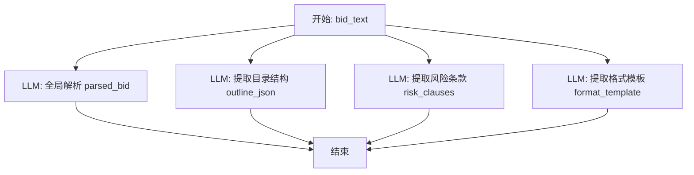
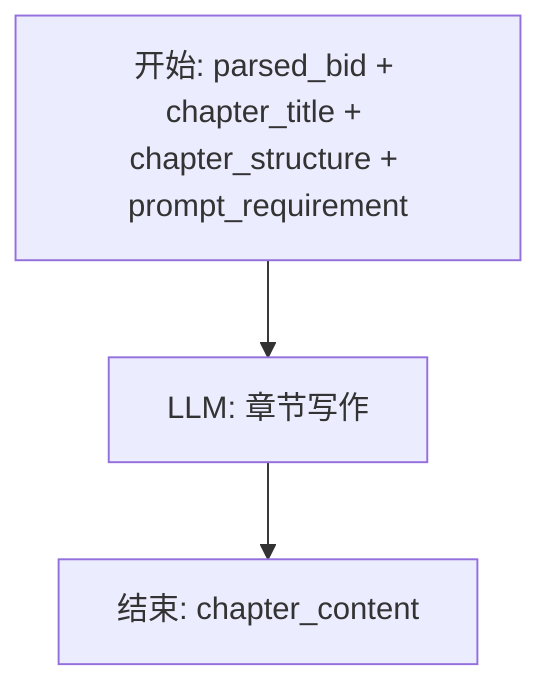
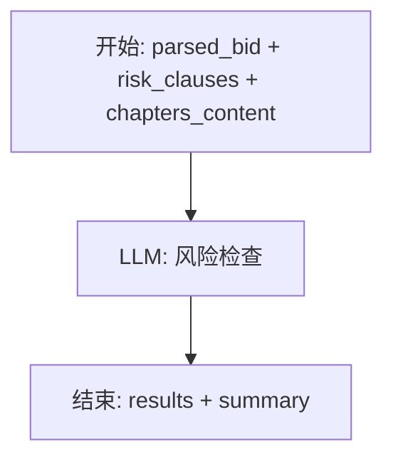

# 09. Dify 工作流拆分设计说明

## 1. 目标

将当前“通用投标文件自动生成工作流”从一个端到端的大工作流，拆分为 3 个边界清晰、可独立调试、可分别由业务系统调用的工作流：

1. 招标文件解析工作流
2. 章节生成工作流
3. 废标检查工作流

本设计严格对应当前项目的业务形态：

- 用户上传招标文件
- 系统先解析出目录树
- 用户人工编辑目录和章节提示词
- 用户按大章逐章生成内容，前端实时流式展示 Markdown
- 用户在全部或部分章节生成后执行废标检查
- 最终导出 Word

当前阶段**不接入知识库**，因此设计中不包含 Dify dataset 检索节点。

---

## 2. 为什么必须拆成 3 个工作流

原始大工作流的问题：

1. **输入输出边界过大**
   - 一次输入招标文件后，直接跑到技术文件、商务文件、价格文件、合并全文。
   - 这和网页系统“先解析目录、再编辑、再逐章生成”的交互模式不一致。

2. **无法支持目录人工编辑**
   - 原工作流中目录结构由 Node3 一次性提取后，直接驱动后续生成。
   - 但网页系统要求：用户可以手工增删改目录、调整顺序、编辑每章提示词。
   - 因此“目录提取”和“正文生成”必须解耦。

3. **无法支持逐章流式生成**
   - 原工作流更适合一次性输出整份文档。
   - 但系统要求按一级章节逐章生成，并且流式实时展示。

4. **难以定位失败点**
   - 解析失败、生成失败、检查失败混在一起，不利于排错。
   - 拆分后可以分别查看哪个阶段失败。

5. **难以持续优化**
   - 解析、生成、检查三类任务使用的大模型能力完全不同。
   - 拆分后可分别优化 Prompt、模型、超时、重试策略。

---

## 3. 拆分后的总体架构


---

## 4. 拆分原则

### 4.1 工作流 1 只负责“理解招标文件”

它的职责是：

- 解析招标文件文本
- 提取目录结构草稿
- 提取招标摘要
- 提取废标/否决/强制响应条款

它**不直接生成标书正文**。

### 4.2 工作流 2 只负责“按章生成正文”

它的职责是：

- 接收已经解析好的招标摘要
- 接收用户确认后的当前章节结构
- 接收当前章节的提示词
- 输出当前大章 Markdown 正文

它**不再处理原始文件上传**。

### 4.3 工作流 3 只负责“检查风险”

它的职责是：

- 基于招标摘要、风险条款、当前标书内容做检查
- 输出结构化问题清单

它**不生成正文**。

---

## 5. 原始节点如何映射到新设计

原始工作流节点：

- Node1 文档转文本
- Node2 招标文件全局解析
- Node3 提取投标文件格式模板
- Node4 提取否决条款与星号条款
- Node5/5b 技术方案判断/骨架生成
- Node6 技术文件生成
- Node7 技术文件自查
- Node8 商务文件生成
- Node9 价格文件生成
- Node10 合并全文

拆分后映射：

### 工作流 1：招标文件解析
- 保留/改造：Node1 + Node2 + Node3 + Node4
- 删除：Node5 ~ Node10

### 工作流 2：章节生成
- 参考/改造：Node6 的思想
- 删除：Node5、Node5b、Node7、Node8、Node9、Node10
- 不再区分技术文件/商务文件/价格文件，而是改成“当前大章生成器”

### 工作流 3：废标检查
- 参考/改造：Node4 + Node7 的思想
- 不再检查单个技术文件，而是检查“当前项目的章节正文全集”

---

## 6. 工作流 1：招标文件解析工作流

## 6.1 目标

输入一份招标文件文本，输出可直接被系统落库和前端展示的解析结果。

## 6.2 触发时机

后端在用户上传招标文件并完成文本提取后调用。

## 6.3 输入

建议只保留一个主输入：

| 变量名 | 类型 | 必填 | 说明 |
|--------|------|------|------|
| `bid_text` | Paragraph / Long Text | 是 | 招标文件提取后的纯文本 |

如果 Dify 版本支持 file 变量，你也可以保留 file 输入，但对于网页系统来说，**推荐后端先提取文本，再把文本传给工作流**，这样更可控。

## 6.4 输出

建议统一输出以下 4 个核心字段：

| 输出变量 | 类型 | 说明 |
|---------|------|------|
| `parsed_bid` | Text | 招标文件结构化解析摘要 |
| `outline_json` | Text | 目录树 JSON 字符串 |
| `format_template` | Text | 招标文件中的投标文件格式模板摘要 |
| `risk_clauses` | Text | 否决条款、星号条款、强制响应条款摘要 |

其中：

- `parsed_bid` 给工作流2、工作流3使用
- `outline_json` 给后端落库生成目录树
- `risk_clauses` 给工作流3使用
- `format_template` 暂时可以保留存档，当前系统首期不一定直接使用

## 6.5 推荐节点结构



说明：

- 原来 Node2、Node3、Node4 可以并行执行
- Node1 文档转文本建议搬到后端，不再放在 Dify 中
- 这样工作流内部逻辑更纯粹：只做大模型理解，不做文件解析

## 6.6 节点说明

### 节点 A：开始节点
输入：
- `bid_text`

### 节点 B：LLM - 招标文件全局解析
职责：
- 抽取项目名称、编号、资格要求、评标办法、技术要求、商务条款等
- 输出 `parsed_bid`

建议 Prompt：
- 直接复用你原 Node2 的大部分 Prompt
- 但输出要更适合后续“章节生成”和“废标检查”使用

建议输出结构：
- 项目基本信息
- 资格要求
- 评标办法
- 技术/供货/服务要求
- 商务条款
- 偏差规定

### 节点 C：LLM - 提取目录结构
职责：
- 只做一件事：把招标文件要求的投标文件目录提取成标准 JSON

这是最关键的改造点。

原 Node3 更偏“模板全文提取”，现在需要新增一个**专门返回 JSON 的节点**。

建议输出格式：

```json
[
  {
    "title": "第一章 项目概述",
    "promptRequirement": "根据招标文件概括项目背景、目标和整体理解",
    "children": [
      {
        "title": "1.1 项目背景",
        "promptRequirement": "围绕招标文件中的项目背景、建设必要性撰写"
      },
      {
        "title": "1.2 建设目标",
        "promptRequirement": "围绕建设目标、交付范围、实施价值撰写"
      }
    ]
  }
]
```

建议 System Prompt：

```text
你是投标文件目录提取器。
你的唯一任务是从招标文件中提取“投标文件组成/目录结构”，并输出合法 JSON。
不要输出解释，不要输出 Markdown 代码块之外的其他文字。
如果原文没有明确目录，则根据文件中的投标文件组成要求整理为一级章+二级节结构。
promptRequirement 字段必须根据章节用途给出简短写作要求。
```

建议 User Prompt：

```text
请从以下招标文件中提取投标文件目录结构，并输出 JSON 数组。

要求：
1. 仅输出 JSON
2. 每个一级节点包含：title, promptRequirement, children
3. 每个二级节点包含：title, promptRequirement
4. 不要虚构招标文件中不存在的章节
5. 如果原文章节命名很长，可以保留原始标题

招标文件原文：
{{bid_text}}
```

### 节点 D：LLM - 提取风险条款
职责：
- 提取星号条款
- 提取否决条款
- 提取实质性响应要求

基本复用原 Node4。

### 节点 E：LLM - 提取格式模板
职责：
- 提取投标函、报价表、偏差表等模板结构
- 当前系统首期不一定直接使用，但建议保留，后续可支持更强的结构化导出与专用章节生成

## 6.7 后端调用方式

后端调用后，将结果写入：

- `TenderFile.parsed_text`
- `TenderFile.parsed_summary` ← 对应 `parsed_bid`
- 可新增 `TenderFile.risk_clauses`
- 可新增 `TenderFile.format_template`
- 将 `outline_json` 解析后写入 `OutlineNode`

## 6.8 失败处理

如果某个字段输出为空：

- `parsed_bid` 为空：解析失败
- `outline_json` 为空：提示“目录提取失败，可重试”
- `risk_clauses` 为空：允许继续，但废标检查能力会弱化

---

## 7. 工作流 2：章节生成工作流

## 7.1 目标

按“当前一级章节”生成 Markdown 正文，并支持流式输出。

## 7.2 触发时机

用户在前端点击“生成本章”后，由后端调用。

## 7.3 输入

根据你确认的方案，当前工作流输入如下：

| 变量名 | 类型 | 必填 | 说明 |
|--------|------|------|------|
| `parsed_bid` | Long Text | 是 | 工作流1输出的招标文件解析摘要 |
| `chapter_title` | Short Text | 是 | 当前一级章节标题 |
| `chapter_structure` | Long Text | 是 | 当前章节及其子节点结构 |
| `prompt_requirement` | Long Text | 否 | 用户在页面中编辑的当前章节写作要求 |

当前阶段**不传知识库 dataset_id**。

## 7.4 输入示例

### `chapter_title`
```text
第三章 技术方案
```

### `chapter_structure`
```text
# 第三章 技术方案
## 3.1 总体设计思路
## 3.2 技术路线
## 3.3 部署架构
## 3.4 实施计划
```

### `prompt_requirement`
```text
重点突出项目理解深度、技术方案完整性、实施可行性，语言正式，避免空话。
```

## 7.5 输出

建议只输出一个主字段：

| 输出变量 | 类型 | 说明 |
|---------|------|------|
| `chapter_content` | Text | 当前章节完整 Markdown 内容 |

如果需要更强可观测性，也可以额外输出：

- `chapter_summary`
- `used_requirements`
- `warnings`

但首期不是必须。

## 7.6 推荐节点结构



当前阶段建议**只保留一个核心 LLM 节点**，不要在 Dify 内再做复杂拆分。

原因：

- 前端是逐章生成，不是整本书生成
- 当前不接知识库
- 先把链路跑通最重要
- 后续如果某类章节质量差，再拆更细的生成子流程

## 7.7 Prompt 设计建议

### System Prompt

```text
你是专业的投标文件撰写助手。
你的任务是根据招标文件解析结果、当前章节结构和用户要求，生成当前章节的标书正文。

要求：
1. 只生成当前章节内容，不生成其他章节
2. 严格围绕当前章节标题和子章节结构组织内容
3. 输出 Markdown
4. 标题层级必须与 chapter_structure 保持一致
5. 语言正式、专业、可直接用于标书初稿
6. 不要编造招标文件中没有的硬性指标、金额、日期、资质
7. 如某项具体信息缺失，用稳妥表述，不虚构事实
8. 如果当前章节更适合写“响应性内容”，要体现对招标要求的逐条响应
```

### User Prompt

```text
请生成以下标书章节内容。

【招标文件解析摘要】
{{parsed_bid}}

【当前章节标题】
{{chapter_title}}

【当前章节结构】
{{chapter_structure}}

【用户补充要求】
{{prompt_requirement}}

生成要求：
1. 只输出当前章节的 Markdown 正文
2. 以当前章节标题为一级标题开始
3. 如果有子章节，必须逐个展开
4. 不输出解释，不输出提示语，不输出“以下为生成内容”之类多余文字
5. 避免套话，尽量写成可编辑的标书草稿
```

## 7.8 为什么不能直接复用原 Node6 / Node8 / Node9

因为原设计是按“技术文件 / 商务文件 / 价格文件”分类生成，而网页系统的真实交互是按“目录树中的一级章节”生成。

两者维度不同：

- 原工作流维度：文档类型维度
- 当前系统维度：目录树章节维度

所以需要把原来“技术/商务/价格”的 Prompt 思路，抽象为一个“通用章节写作器”。

## 7.9 后续可演进方案

如果后续你发现某些章节生成效果差，可以按章节类型细分为多个子工作流：

- 技术方案章节生成器
- 商务响应章节生成器
- 报价说明章节生成器
- 实施方案章节生成器

但首期不要这样拆，会把复杂度拉高。

## 7.10 流式输出注意事项

Dify 工作流2需要开启 streaming 模式。

后端负责：

1. 调 Dify workflow run（streaming）
2. 读取 Dify SSE 数据
3. 转发给前端自己的 SSE 接口
4. 前端实时追加到 Markdown 预览区
5. 结束后把完整文本落库

注意：

- Dify 输出字段最好统一为 `chapter_content`
- 如果 Dify 只在 `workflow_finished.outputs` 中给最终文本，也可以由后端拼接后一次性落库

---

## 8. 工作流 3：废标检查工作流

## 8.1 目标

检查当前标书正文是否覆盖招标文件中的关键要求、否决条款、强制响应项，并输出结构化风险列表。

## 8.2 触发时机

- 用户点击“执行废标检查”时触发
- 或后续在系统中增加“主要章节已完成后提醒检查”

## 8.3 输入

建议输入如下：

| 变量名 | 类型 | 必填 | 说明 |
|--------|------|------|------|
| `parsed_bid` | Long Text | 是 | 工作流1输出的招标摘要 |
| `risk_clauses` | Long Text | 否 | 工作流1输出的风险条款摘要 |
| `chapters_content` | Long Text | 是 | 当前项目所有已生成章节正文拼接后的全文 |

说明：

- 如果当前数据库里还没有 `risk_clauses` 字段，也可以先只传 `parsed_bid + chapters_content`
- 但最佳实践是把 `risk_clauses` 存起来，一起传给工作流3

## 8.4 输出

建议输出标准 JSON 数组，字段固定：

```json
[
  {
    "riskLevel": "high",
    "title": "缺少授权委托书响应",
    "description": "招标文件明确要求提供法定代表人授权委托书，当前标书正文中未体现相关响应。",
    "suggestion": "在商务响应章节补充授权委托书说明，并在附件中补齐材料。",
    "relatedOutlineNodeId": null
  }
]
```

同时可以再输出一个汇总：

```json
{
  "summary": {
    "high": 1,
    "medium": 2,
    "low": 3
  }
}
```

## 8.5 推荐节点结构



## 8.6 Prompt 设计建议

### System Prompt

```text
你是投标文件风险审查助手。
你的任务是根据招标文件要求和当前标书内容，识别可能导致废标、响应不完整或评分不足的风险。

要求：
1. 输出结构化结果
2. 风险等级仅允许：high / medium / low
3. 不要输出与投标无关的建议
4. 重点检查：否决条款、星号条款、资格要求、强制响应项、关键商务条款
5. 如果无法确认某条是否已满足，应标记为 medium 而不是 high
```

### User Prompt

```text
请检查当前标书内容的风险。

【招标文件解析摘要】
{{parsed_bid}}

【关键风险条款】
{{risk_clauses}}

【当前标书正文】
{{chapters_content}}

请输出 JSON 数组。
每项包含以下字段：
- riskLevel
- title
- description
- suggestion
- relatedOutlineNodeId

风险等级定义：
- high：可能直接导致废标或资格不符
- medium：可能导致响应不完整或关键内容不足
- low：建议优化项

只输出 JSON，不要输出解释。
```

## 8.7 原 Node7 如何迁移

原 Node7 是“技术文件自查”，它只核对技术文件是否覆盖星号条款。

现在要升级为“全项目级废标检查器”：

- 检查范围从“技术文件”扩大到“所有章节内容”
- 检查维度从“星号条款覆盖”扩大到“否决条款、资格、强制响应、风险提示”
- 输出从 Markdown 表格改成 JSON 结果数组

---

## 9. 三个工作流的接口契约

## 9.1 工作流 1：解析

### 输入
```json
{
  "bid_text": "...招标文件全文..."
}
```

### 输出
```json
{
  "parsed_bid": "...解析摘要...",
  "outline_json": "[...]",
  "format_template": "...格式模板摘要...",
  "risk_clauses": "...风险条款摘要..."
}
```

## 9.2 工作流 2：章节生成

### 输入
```json
{
  "parsed_bid": "...",
  "chapter_title": "第三章 技术方案",
  "chapter_structure": "# 第三章 技术方案\n## 3.1 总体设计\n## 3.2 实施计划",
  "prompt_requirement": "重点突出可实施性和完整性"
}
```

### 输出
```json
{
  "chapter_content": "# 第三章 技术方案\n...markdown..."
}
```

## 9.3 工作流 3：废标检查

### 输入
```json
{
  "parsed_bid": "...",
  "risk_clauses": "...",
  "chapters_content": "# 第一章...\n# 第二章..."
}
```

### 输出
```json
{
  "results": [
    {
      "riskLevel": "high",
      "title": "...",
      "description": "...",
      "suggestion": "...",
      "relatedOutlineNodeId": null
    }
  ],
  "summary": {
    "high": 1,
    "medium": 2,
    "low": 3
  }
}
```

---

## 10. 后端如何配合这 3 个工作流

## 10.1 后端职责

后端不是简单透传，而是做业务编排：

### 解析阶段
- 接收用户上传文件
- 提取文本
- 调工作流1
- 落库解析结果
- 写入目录树

### 生成阶段
- 读取项目解析摘要
- 读取当前章节标题/子节点/提示词
- 调工作流2
- 转发流式输出给前端
- 保存章节版本

### 检查阶段
- 读取 parsed_bid / risk_clauses / 全部章节正文
- 调工作流3
- 保存检查结果
- 返回给前端

## 10.2 建议新增的数据库字段

当前你已有：
- `TenderFile.parsed_summary`

建议再补两个字段：
- `TenderFile.risk_clauses`
- `TenderFile.format_template`

这样后续工作流3可以直接复用风险条款，无需重新解析。

---

## 11. Dify 中的实际搭建建议

## 11.1 工作流1的实际命名

建议命名：
- `bid-file-parse-workflow`

## 11.2 工作流2的实际命名

建议命名：
- `bid-chapter-generate-workflow`

## 11.3 工作流3的实际命名

建议命名：
- `bid-risk-check-workflow`

## 11.4 环境变量 / API Key 管理

后端分别维护三个独立 API Key：

- `DIFY_API_KEY_PARSE`
- `DIFY_API_KEY_GENERATE`
- `DIFY_API_KEY_CHECK`

这样做的好处：

- 权限更清晰
- 单个工作流替换时不影响其他调用
- 调试时更容易定位问题

---

## 12. 实施顺序建议

推荐按下面顺序落地：

### 第一步：先完成工作流1
原因：
- 没有解析结果，前端目录树无法开始
- 这是整个系统的入口

### 第二步：完成工作流2
原因：
- 这是用户最核心的“生成价值”部分
- 只要能按章流式生成，系统就已经具备主价值

### 第三步：完成工作流3
原因：
- 这是增强能力
- 不影响主链路跑通

---

## 13. 首期最简可用版本

如果你希望快速跑通，首期最小方案可以这样做：

### 工作流1
保留：
- `parsed_bid`
- `outline_json`

暂缓：
- `format_template`
- `risk_clauses`

### 工作流2
只保留：
- 单一 LLM 节点生成 `chapter_content`

### 工作流3
可以先只用：
- `parsed_bid`
- `chapters_content`

即便这样，也足以支撑：
- 上传
- 解析目录
- 编辑目录
- 逐章生成
- 结果检查
- 导出

---

## 14. 最终结论

你当前这个项目，正确的 Dify 设计方式不是继续维护一个“大而全”的完整投标工作流，而是改造成下面这 3 个业务型工作流：

### 工作流1：招标文件解析
负责把“原始招标文件”变成“系统可操作的数据”

### 工作流2：章节生成
负责把“用户确认后的目录 + 提示词”变成“当前章节 Markdown 正文”

### 工作流3：废标检查
负责把“招标要求 + 当前标书内容”变成“结构化风险清单”

这是从“单次 AI 生成文档”转向“可编辑、可追踪、可流式的 Web 产品”必须要做的架构调整。

---

## 15. 下一步建议

下一步可以继续补两份文档：

1. **Dify 工作流 1/2/3 的逐节点配置清单**
   - 每个节点用什么类型
   - 每个变量怎么命名
   - 每个 Prompt 最终文本怎么写

2. **后端对接 Dify 的字段映射文档**
   - Flask 请求体怎么组装
   - Dify 输出怎么解析
   - 数据库字段怎么落库

如果你要，我下一条可以直接继续给你：

- **三个工作流的 Dify 逐节点配置表**
- **可直接复制进 Dify 的 Prompt 完整版**
